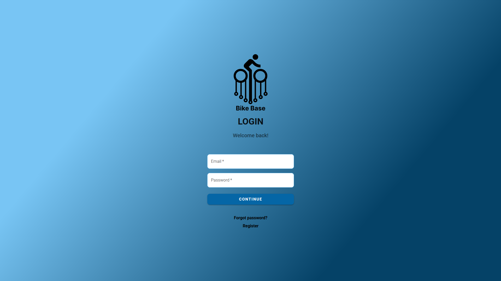
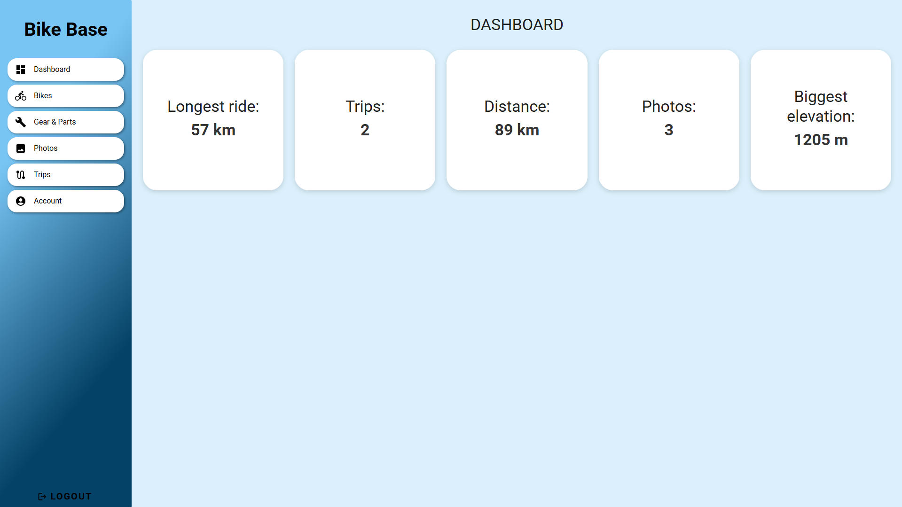
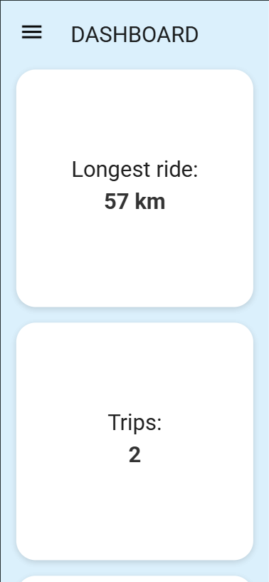
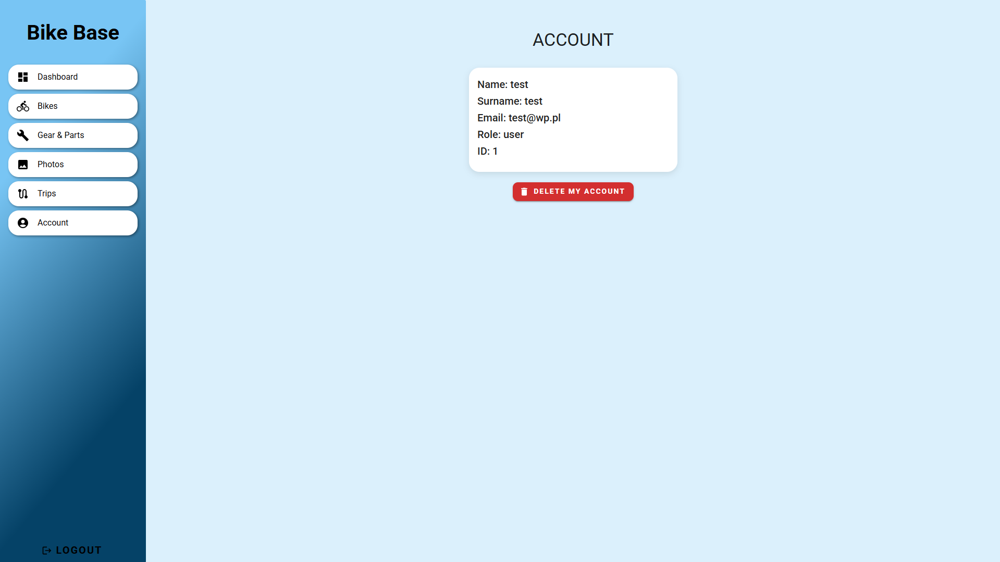
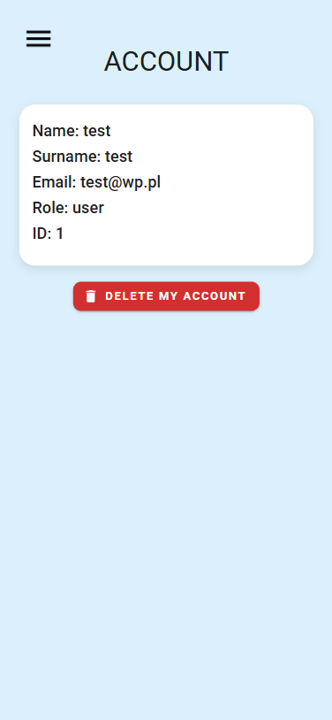

# Bike Base
Aplikacja webowa do zarządzania danymi rowerowymi

## Opis projektu
BikeBase jest aplikacją webową umożliwiającą użytkownikom zarządzanie danymi związanymi z aktywnością rowerową. System pozwala na:
- dodawanie kart z rowerami,
- tworzenie listy części i sprzętu rowerowego,
- zapisywanie tras,
- tworzenie galerii zdjęć,
- zarządanie kontami użytkowników,
- autoryzację i kontrolę dostępu (JWT).

Projekt został zrealizowany w architekturze frontend + backend + baza danych, z pełną konteneryzacją przy użyciu oprogramowania Docker.

## Zrzuty ekranu z aplikacji
Ekran logowania

Dashboard - widok po zalogowaniu

Account - panel do zarządzania kontem

## Wykorzystane technologie
### **Backend**
- Node.js - Został wykorzystany ze względu na asynchroniczny model I/O, który dobrze sprawdza się w aplikacjach webowych, z których korzysta wielu użytkowników na raz.
- Express.js - Wykorzystany do implementacji REST API ze względu na swoją elastyczność i przejrzysta organizację routingu.
- Prisma ORM - Upraszcza komunikację pomiędzy aplikacją i bazą PostgreSQL, co skutkuje eliminacją błędów, które mogą pojawić się podczas ręcznego pisania zapytań SQL.
- RabbitMQ - System kolejkowy umożliwiający asynchroniczne przetwarzanie danych został użyty, aby odciążyć główny wątek backendu.
- JWT
- Multer (upload plików)
- Docker

### **Frontend**
- React – Biblioteka do budowy interfejsów użytkownika została użyta, ponieważ umożliwia tworzenie aplikacji typu SPA.
- Vite – Wybrany, ponieważ umożliwia szybki start projektu i krótki czas przeładowań.
- Material UI (MUI) – Biblioteka przyspieszająca tworzenie spójnego interfejsu użytkownika.
- Axios – Ta biblioteka do komunikacji HTTP z backendem została wybrana z powodu prostej obsługi zapytań REST, a także łatwej konfiguracji tokenów JWT. Dodatkowo Axios umożliwia centralne zarządzanie obsługą błędów co jest bardzo pomocne podczas tworzenia projektu.
- Docker

### **Inne**
- Docker Compose
- Swagger (dokumentacja API)

## Wymagania wstępne do uruchomienia projektu
- Docker
- Docker Compose
- Przeglądarka internetowa

## Uruchamianie i zatrzymywanie projektu
1. Przejdź do głównego katalogu projektu (tam gdzie znajduje się plik docker-compose.yml, czyli ZTPAI).
2. Uruchom aplikację za pomocą polecenia docker compose up.
3. Zakończ działanie aplikacji za pomocą polecenia docker compose down.

Po wpisaniu polecenia opisanego w punkcie 2, wszystkie usługi zostaną uruchomione - nie trzeba uruchamiać każdej z nich osobno.

## Dostępne usługi
1. Frontend - [http://localhost:5173](http://localhost:5173)
2. Backend API - [http://localhost:5000](http://localhost:5000)
3. Swagger API - [http://localhost:5000/api/docs](http://localhost:5000/api/docs)
4. RabbitMQ UI - [http://localhost:15672](http://localhost:15672)

Domyślne dane logowania do RabbitMQ:
Login: guest
Hasło: guest

## Baza danych
Baza danych jest zarządzana przez Prisma, a jej schemat prezentuje się następująco: 

